# CENGOT — WRO 2026 Future Engineers

This repository contains the engineering materials for Team CENGOT's WRO 2026 entry. The project structure follows the WRO engineering-materials template and provides placeholders and guidance for the files required by the competition.

# Table of contents

- Project overview
- Repository structure
- Hardware & BOM (placeholder)
- Schematics and wiring
- 3D models and mechanical parts
- Software (control code)
- Media (photos & video)

---

# Project overview

CENGOT Robot is an autonomous small-scale vehicle developed for the WRO 2026 Future Engineers track. The platform is designed to compete in both the Open and Obstacle challenge modules by combining reliable low-level control, on-board perception, and modular mechanical design. The system emphasizes reproducibility, easy repair (3D-printable parts), and clear documentation so judges and developers can reproduce the build and test results.

## Objectives
- Reliable line-following on printed tracks with robust recovery when the line is lost.
- Color-based and distance-based obstacle detection with safe avoidance behaviours.
- Modular, printable mechanical parts for quick iteration and repair.
- Well-documented build instructions, wiring diagrams, and reproducible software deployment steps.

## System architecture
- High-level processing: Raspberry Pi (Zero 2 W or 4) running Python/OpenCV for camera-based perception, mission planning and telemetry.
- Low-level control: ESP32 for real-time motor and servo control, sensor polling, and encoder counting.
- Sensors: 
- Actuators: Two DC gear motors with encoders driven by an H-bridge motor driver; servo for steering.

## Software overview
- Perception: OpenCV-based color segmentation and contour analysis for obstacle detection.
- Control:
- Utilities: calibration scripts (camera, sensors), data-logging and replay tools, and automated upload scripts for microcontroller firmware.

## Performance targets
- Line-following accuracy: maintain center within ±2 cm at typical test speeds.
- Obstacle detection: reliably detect colored obstacles at ≥0.5 m in normal indoor lighting.
- End-to-end demo runtime: at least 3 minutes running on the chosen battery (depends on battery capacity and motor load).

## Repository deliverables
- Mechanical files and printable parts: `models/`
- Wiring diagrams and schematics: `schemes/`
- Source code and sketches: `src/`
- Team and vehicle photos: `t-photos/`, `v-photos/`
- Demonstration videos and links: `video/`

## Members:

Artun Andaç (Team Leader)

- Freshman, Dokuz Eylül University.
- Role:
- Contact: artunandac0@gmail.com


Ediz Uçar

- Freshman, Dokuz Eylül University
- Role:
- Contact: ucar.ediz35@gmail.com


Can Özdemir

- Freshman, Dokuz Eylül University
- Role:
- Contact: canozdemir8084@gmail.com


Coach:


Hakan Akduman

- Senior, Dokuz Eylül University
- Contact: hakanakduman2002@gmail.com

---

# Repository structure

| Directory | Purpose / Contents |
|---|---|
| [models/](models/) | 3D-printable parts and CAD files (3MF, STL, STEP) with assembly notes and print settings |
| [schemes/](schemes/) | Circuit diagrams, wiring lists and schematics (PNG, JPG, PDF) |
| [src/](src/) | Source code: Arduino sketches, Python scripts, utilities, and build/upload instructions |
| [other/](other/) | Additional documentation: datasheets, communication protocols, SBC setup notes, datasets, troubleshooting |
| [t-photos/](t-photos/) | Team photos (official and casual) with captions and names |
| [v-photos/](v-photos/) | Vehicle photos covering multiple views (front, back, left, right, top, bottom) |
| [video/](video/) | Demonstration videos and `video.md` with links and timestamps |

---

# Hardware 


Add links to datasheets and pinouts in `schemes/`.

---


| Used in | Name | Photo | Description | Quantity |
|---|---|---|---|---|
| Obstacle detecting | Raspberry Pi Zero 2 W |  | Main onboard computer that runs the Python vision software and processes camera frames with OpenCV. | 1 |
| Obstacle detecting | Raspberry Pi Camera Module 3 |  | Camera module that captures the live image stream used to detect the red and green obstacle signs on the track. | 1 |
| Obstacle detecting | Raspberry Pi Camera Ribbon Cable |  | Flexible cable that connects the camera module to the Raspberry Pi and transfers image data for processing. | 1 |

---

# Schematics and wiring

The object-detecting schematic below shows the camera-based vision setup used in the obstacle module. In the project, this scheme is the link between image capture and obstacle decisions: the camera collects the scene, the Raspberry Pi processes it, and the result is used by the robot's driving logic.

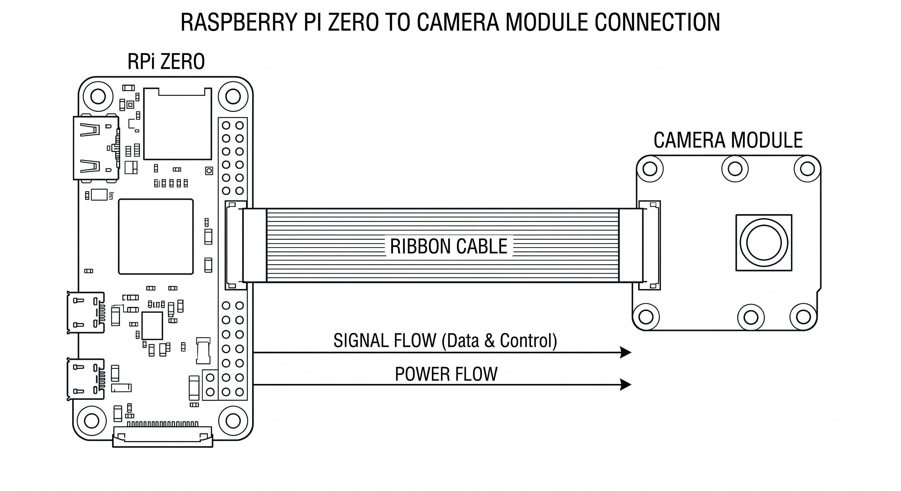

Store all other schematic files in `schemes/` and keep them captioned clearly so the purpose of each diagram is easy to understand.

---

# 3D models and mechanical parts

- `models/new_design/` — the competition-ready redesign. This is the current, production-ready collection used for the final build.
- `models/old_design/` — archived iterations and legacy variants kept for reference and troubleshooting.

## Why this folder matters
- Fully original: the chassis, wheel hubs, axles, motor mounts, Ackerman steering linkage, servo tower, camera mount (base/head/body), and power-transfer components were modeled from scratch for this project. No third-party CAD parts were imported — every printable geometry was created or adapted by the team to meet packaging, strength and assembly constraints.
- Ready-to-print: parts are exported as 3MF/STL and accompanied by preview images so you can quickly validate orientation and look before printing.

## Quick visual tour
- Wheel system: 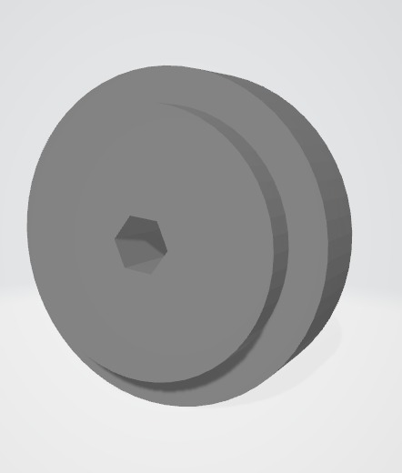 — compact, printable, and tuned for a cleaner press-fit than the early versions.
- Front axle path: 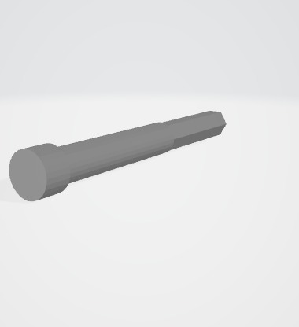 — simplified geometry that reduces play and makes alignment easier.
- Rear axle and drive transfer: 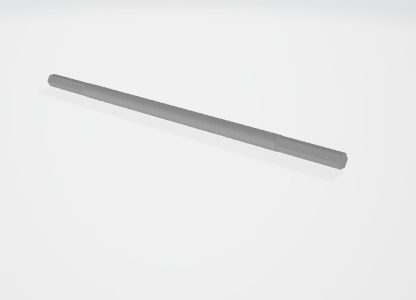 and 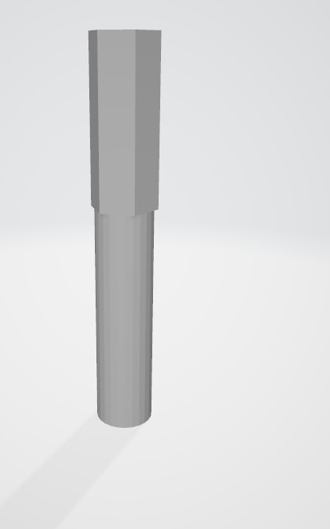 — built to keep the drivetrain stable and the load path predictable.
- Steering linkage: 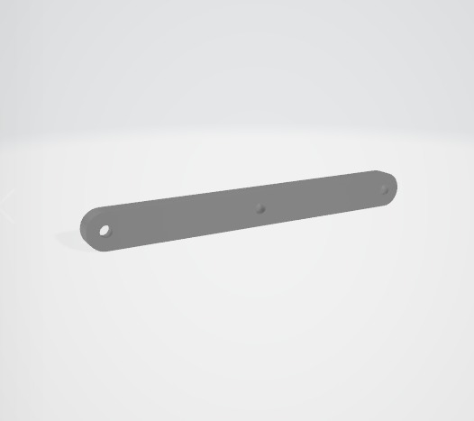 and 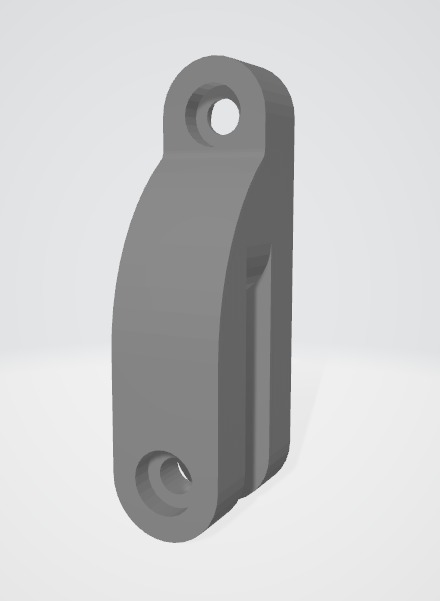 — refined so the steering response is smoother and the geometry is easier to tune.
- Servo tower and top support: 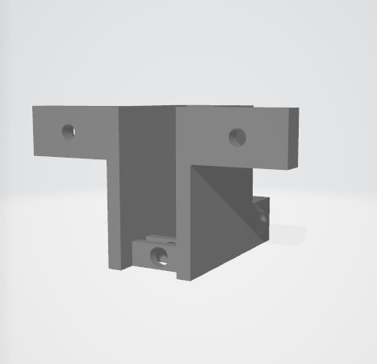 and 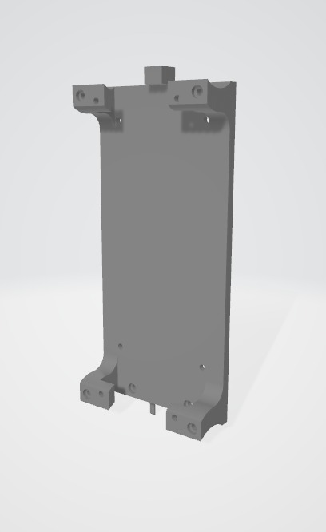 — designed to stiffen the front assembly and reduce flex.
- Camera module: 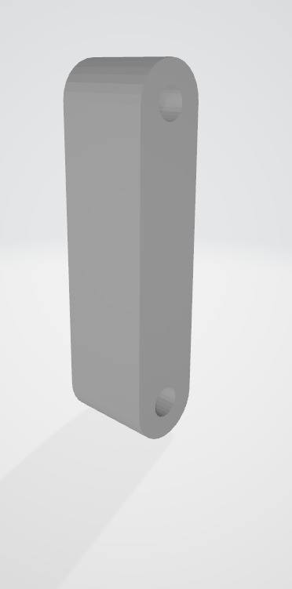, 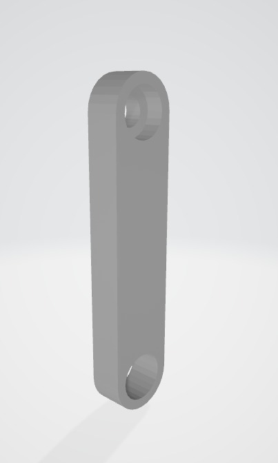, and 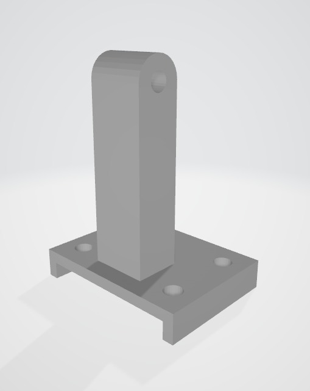 — split into separate pieces so the camera angle can be adjusted without rebuilding the mount.
- Chassis base: 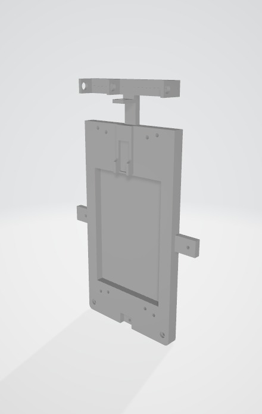 — cleaner structure, simpler mounting points, and more practical access to electronics than the earlier body shells.

## Old design vs new design

| Area | Old design | New design | Improvement |
|---|---|---|---|
| Chassis | Larger, more fragmented body parts with more experimental geometry | Cleaner base structure with more deliberate mounting areas | Better access, easier assembly, and less wasted print time |
| Steering | More iterations and loose linkage experiments | Refined Ackerman geometry and clearer servo connection path | Smoother steering and more predictable turn behavior |
| Axles / drivetrain | Multiple legacy axle variants used for testing | More compact axle and transfer layout | Reduced complexity and better mechanical consistency |
| Camera mount | Earlier mounts were more rigid and less adjustable | Split camera mount with base, body, and head sections | Easier angle tuning and faster replacement if a part breaks |
| Wheel parts | Several prototype wheel revisions | Final wheel geometry tuned for fit and printability | Better press-fit behavior and cleaner assembly |
| Overall packaging | More trial-and-error and bulkier assemblies | More compact, purpose-built layout | Less clutter, faster service, and a more competition-ready build |

## What changed in practice
- The new design is not just a visual cleanup; it is a structural improvement. Parts were simplified where possible, reinforced where needed, and split into assemblies that are easier to print and replace.
- The final model makes better use of print volume and reduces the amount of post-processing needed before assembly.
- The geometry was reworked to make the robot easier to service during competition, especially around steering, camera alignment, and drivetrain access.

## Assembly highlights
- Fasteners: mostly M3 screws; use M2.5 where space is limited. Use washers and threadlock for high-vibration locations.
- Orientation & supports: many parts were designed to be printed upright to preserve bore integrity — check preview images in each subfolder for recommended orientation.

## Design provenance and license
- All `models/new_design/` parts are original to this project and intended for reproduction by teams and judges.
- Licensing: see [models/LICENSE](models/LICENSE) for terms; per-file notes and preview images live in the corresponding subfolders (see `models/README.md`).

---

## Software (src)

The `src/` folder contains the working software for the robot, plus one short guide that explains how to run it. The code is intentionally split into three parts so each layer can be checked and improved separately before everything is combined.

The Arduino side is made of two control sketches: [src/28_Mayis_Kontrol_Kodu_old.ino](src/28_Mayis_Kontrol_Kodu_old.ino) and [src/28_Mayis_Kontrol_Kodu_new.ino](src/28_Mayis_Kontrol_Kodu_new.ino). The old sketch is a quick hardware check, while the new sketch is the main robot-control version that reads sensors, sends data to the Raspberry Pi, and accepts basic steering and motor commands.

The vision side is handled by [src/obstacle_detector.py](src/obstacle_detector.py). This script uses the Raspberry Pi camera to detect red and green obstacle signs and convert what it sees into a simple driving decision. It looks only at the useful part of the image, filters the colors, removes noise, finds the strongest obstacle candidate, and reports the result in a form the robot can use. This makes it a compact module that can be tested alone before being connected to the rest of the control system.

```python
roi_frame, offset_x, offset_y = get_region_of_interest(corrected_frame)
hsv_frame = cv2.cvtColor(roi_frame, cv2.COLOR_RGB2HSV)

for color_name, hsv_ranges in COLOR_RANGES.items():
	mask = create_color_mask(hsv_frame, hsv_ranges)
	obstacle = find_largest_obstacle(mask, color_name, offset_x, offset_y)
```

```python
if obstacle_color == "red":
	steering_command = "steer_left"
elif obstacle_color == "green":
	steering_command = "steer_right"
else:
	steering_command = "go_straight"
```

The most useful parts of the obstacle-detection logic are the ones that make the camera output more stable and easier to trust on the track. First, the script does not analyze the whole frame; it focuses on a smaller region where the obstacle is expected to appear. That simple move reduces background distractions and makes the robot react to the sign that actually matters in front of it. Then the image is handled in HSV color space instead of raw camera colors, because HSV is much more forgiving when lighting changes. This is especially helpful in an indoor competition environment where shadows, reflections, and brightness shifts can confuse a plain RGB-based detector.

```python
ROI_TOP_RATIO = 0.25
ROI_BOTTOM_RATIO = 0.95
ROI_LEFT_RATIO = 0.10
ROI_RIGHT_RATIO = 0.90

COLOR_RANGES = {
	"red": [((0, 70, 50), (12, 255, 255)), ((165, 70, 50), (180, 255, 255))],
	"green": [((40, 60, 50), (88, 255, 255))]
}
```

The color matching itself is also tuned in a practical way. Red is treated with two separate hue ranges so the script can catch both ends of the red spectrum, while green has its own defined range. After that, the detector uses mask cleanup steps to remove tiny noisy spots and close small gaps inside the detected shapes. That means the robot is less likely to react to random pixels, small reflections, or partial detections. Once the cleaned mask is ready, the script looks for contours and keeps the largest valid one as the main obstacle. In simple terms, the system assumes the biggest matched object is the one the robot should care about most.

```python
kernel = np.ones((5, 5), np.uint8)
total_mask = cv2.morphologyEx(total_mask, cv2.MORPH_OPEN, kernel)
total_mask = cv2.morphologyEx(total_mask, cv2.MORPH_CLOSE, kernel)

largest_contour = max(contours, key=cv2.contourArea)
contour_area = cv2.contourArea(largest_contour)
```

Finally, the obstacle position is interpreted relative to the center of the frame, with a small dead zone so the robot does not overreact to tiny shifts. The output becomes a very direct driving choice: red leads to a left steering response, green leads to a right steering response, and no valid obstacle means the robot keeps moving normally. This is the part that makes the module useful in practice, because it turns camera data into a decision the robot can actually follow.

```python
if obstacle_center_x < frame_center_x - CENTER_DEAD_ZONE:
	return "left"
if obstacle_center_x > frame_center_x + CENTER_DEAD_ZONE:
	return "right"
return "center"
```

## Evolution of `obstacle_detecting`
- This module did not start as a dedicated obstacle detector. Earlier, the idea was closer to a general `color_detecting` script that tried to identify colors in the camera image.
- Over time, the project moved away from broad color recognition and toward a task-based obstacle module. That is why the script was renamed and reorganized into `obstacle_detecting`.
- The newer version is more practical for competition use: it focuses on only the colors that matter, uses a tighter image region, filters out noise, and turns the visual result into an actual driving choice.
- In other words, the change was not just cosmetic. The script evolved from a broad experimental detector into a focused obstacle-handling tool that matches the game rules better.

To run the software in practice, upload the Arduino sketch that matches the current hardware setup, then start the Python obstacle detector on the Raspberry Pi.

---

# Media (team & vehicle photos, videos)

- `t-photos/` — add an official team photo and one casual team photo. Include a caption and names in a small `t-photos/README.md` file.
- `v-photos/` — photos of the assembled robot: front, back, left, right, top, bottom. Include orientation notes and scale references.
- `video/video.md` — include links to demonstration videos (YouTube or raw files) and a short timestamped description of what the video shows.

Example `video/video.md` content:

```
Driving demonstration — https://youtu.be/your_video_id — shows line-following and obstacle avoidance.
```

---


# License

- **Code & scripts:** MIT License — see `LICENSE` for the full text.
- **3D models & mechanical designs (models/):** Creative Commons Attribution-ShareAlike 4.0 — see `models/LICENSE` for details.

---


