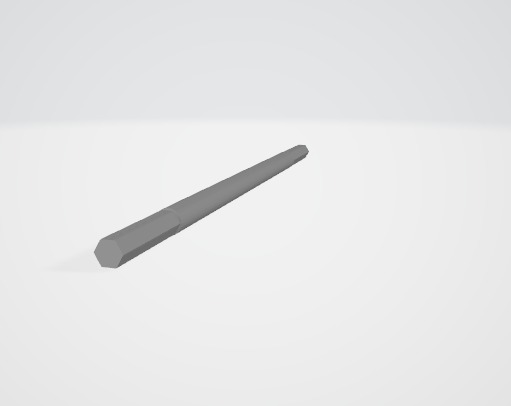

Models
===

This folder contains the 3D model files used to manufacture the vehicle parts shown in the project documentation. The table below works as a visual index for the exported preview images and gives a short explanation of each part's role in the vehicle.

| Preview | Model name | Function |
| --- | --- | --- |
|  | Hex Spacer Disk | A compact circular spacer with a hex opening that keeps a shaft or connector centered and helps prevent slipping. |
|  | Steering Link Arm | Transfers servo motion into the steering linkage and helps turn the front assembly. |
|  | Long Link Rod | Connects steering components across a longer distance and keeps motion synchronized. |
|  | Motor Axle | Couples motor output to the driven wheel or gear train. |
|  | Chassis Base Assembly | Main structural base that supports the electronics, mounts, and overall vehicle layout. |
|  | Front Wheel Shaft | Supports the front wheel and keeps the wheel alignment stable during motion. |
|  | Shaft Retainer | Locks the shaft in place and prevents unwanted axial movement. |
|  | Main Body Shell | Core body frame that holds the vehicle layout together and provides mounting space. |
|  | Steering Shaft Front Bracket | Front steering shaft holder and linkage anchor for the direction mechanism. |
|  | Drive Gear V1 | First gear version used in the transmission to transfer torque. |
|  | Drive Gear V2 | Alternative gear version used for ratio or mesh adjustments. |
|  | Axle Assembly | Full axle subassembly used to mount the wheels and connect the drivetrain. |
|  | Steering Connector Arm Assembly | Joint piece that ties the servo movement to the steering arms. |
|  | Long Hex Shaft | Hex-profile shaft that transmits torque without slipping inside the coupling. |
|  | U-Shaped Connector | Bridge part that links two mounting points while leaving clearance around the motion path. |
|  | Long Connector Plate | Flat support plate used to stiffen the linkage structure and improve alignment. |
|  | Main Body Variant | Alternate body layout used for fit checks and assembly testing. |
|  | Thin Shaft | Small-diameter shaft for light rotating parts or guide elements. |
|  | Steering Connector Arm V2 | Revised steering link with improved geometry for cleaner motion transfer. |
|  | L-Shaped Arm | Offset lever used for steering or support where a change in direction is needed. |
|  | Rectangular Block | Simple mounting block used for spacing, reinforcement, or local support. |
|  | Long Round Plate | Stabilizing plate that spreads load over a wider surface. |
|  | Shoulder Shaft | Stepped shaft that keeps parts fixed at precise positions along the axis. |
|  | L-Shaped Link Arm | Linkage arm that changes the motion direction between two connected parts. |
|  | Hex-Base Shaft | Hex-driven shaft that improves torque transfer and reduces rotation slip. |
|  | Linkage Assembly | Combined subassembly showing the connected steering or drive parts as one unit. |
|  | Pulley Disk V1 | First pulley-style disk used for rotation transfer or spacing. |
|  | Hex Socket Spacer | Spacer with a hex recess that locks the shaft or connector into place. |
|  | Short Shaft | Compact shaft for short rotating or locating sections. |
|  | Long Shaft V2 | Extended shaft version used where a longer reach or wider support is needed. |
|  | Hook Arm Assembly | Hooked linkage used to latch, guide, or restrain a moving element. |
|  | Pulley Disk V2 | Updated pulley-style disk with a refined profile and fit. |
|  | Gear Wheel V1 | First gear wheel variant used for drivetrain testing and torque transfer. |
|  | Pulley Disk V3 | Third disk revision created for improved balance, fit, or durability. |
|  | Gear Wheel V2 | Revised gear wheel with adjusted teeth or thickness for better engagement. |
