Models
===

This folder contains the 3D model files used to manufacture the vehicle parts shown in the project documentation. The table below is a visual index for the model families used in the vehicle.

Some rows include more than one preview image because those files are alternate screenshots of the same part captured in different CAD programs, different views, or different revisions. That is intentional: the table groups the screenshots by physical part instead of listing every export as a separate model.

| Preview | Model name | Function |
| --- | --- | --- |
| 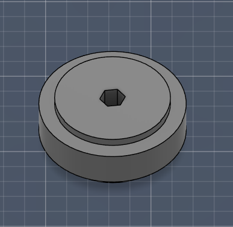  | Hex Spacer / Socket Spacer | These parts center a shaft or connector and stop unwanted slipping. They are used wherever a hex profile is needed to keep rotation locked and stable. |
| 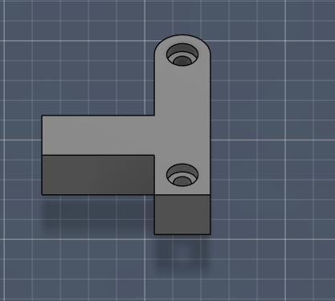  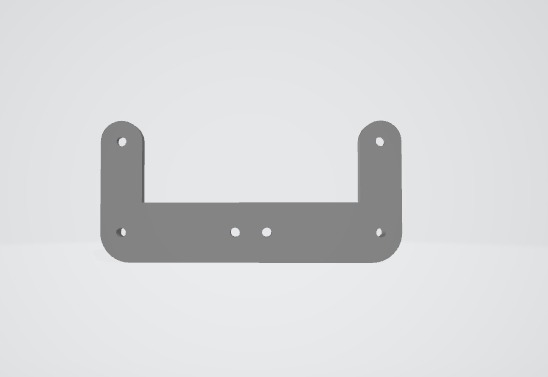 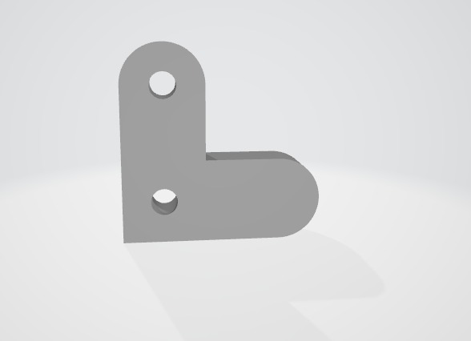 | Steering Connector Arm | This linkage transfers servo motion into the steering mechanism. It is responsible for turning the front assembly with controlled and repeatable movement. |
| 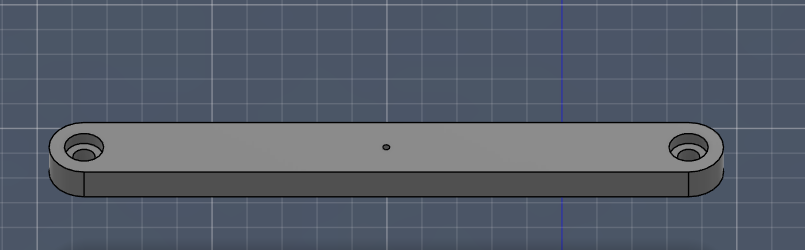 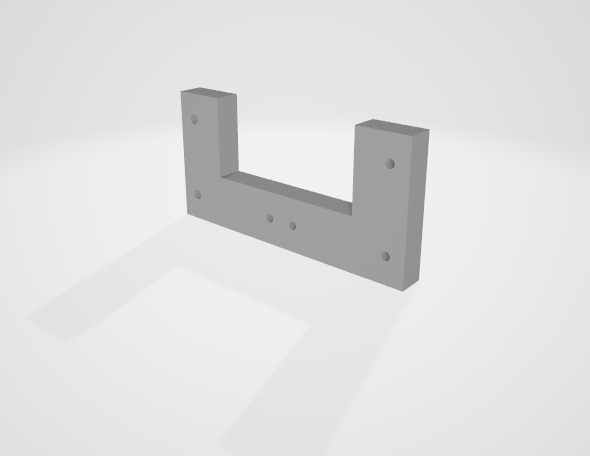 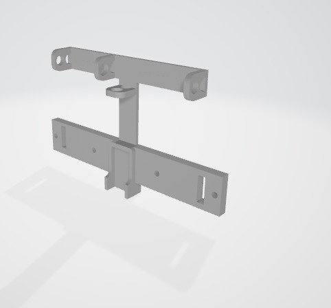 | Long Connector Parts | These bridge pieces keep two mounting points aligned over a longer distance. They help the steering and chassis subassemblies stay rigid while still leaving motion clearance. |
|  | Motor Axle | This part couples motor output to the drivetrain. It transfers torque from the motor into the wheel or gear system. |
|  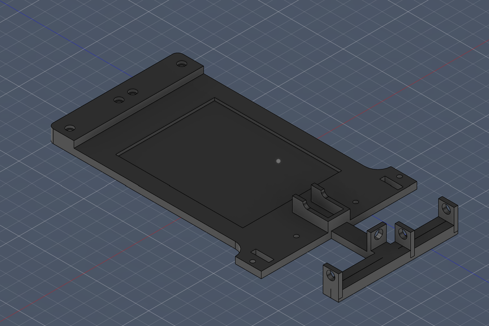 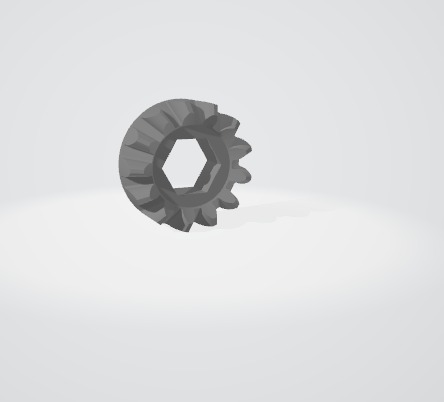 | Chassis and Body Frame | This is the main structural base of the vehicle. It supports the electronics, mounting points, and overall layout of the robot body. |
|  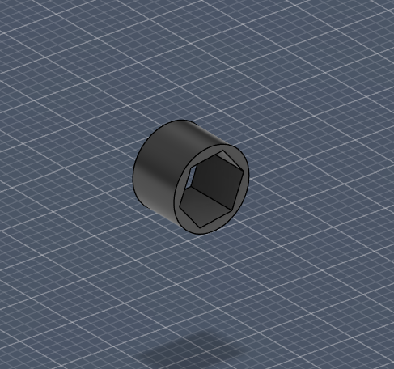 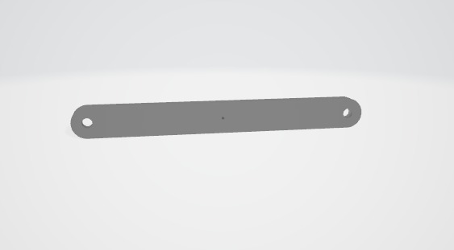 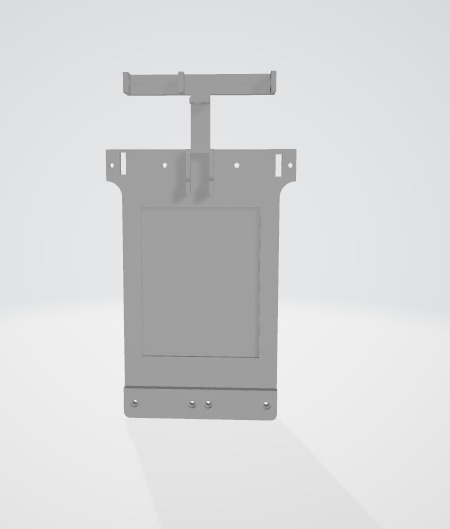 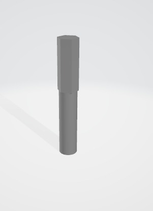 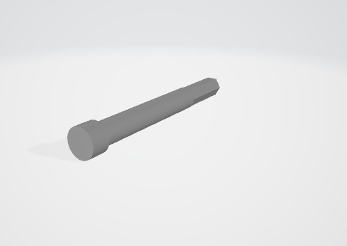 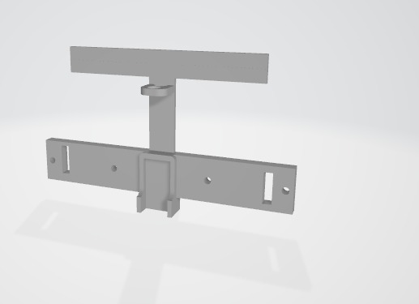 | Shaft and Axle Family | These shaft parts carry wheels or rotating elements and keep them aligned during motion. Different versions are used depending on length, support, and torque-transfer needs. |
| 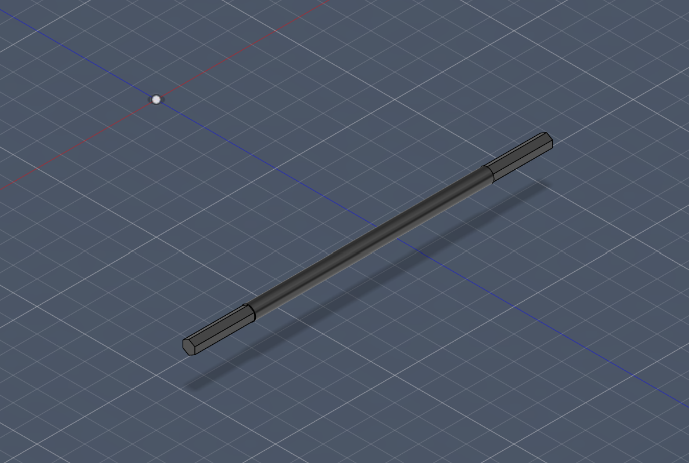 | Steering Shaft Front Bracket | This bracket holds the steering shaft at the front of the vehicle. It acts as the anchor point for the direction mechanism. |
|  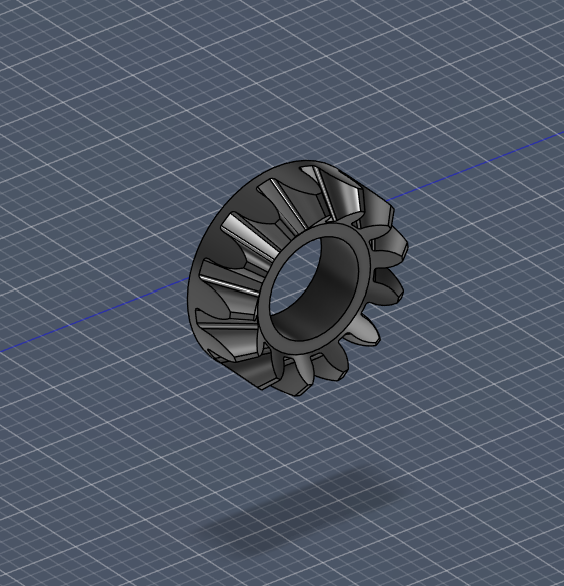  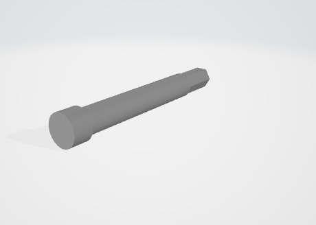 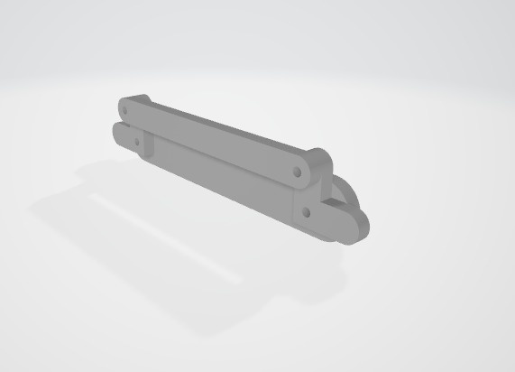 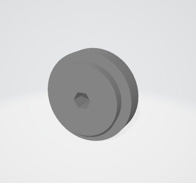 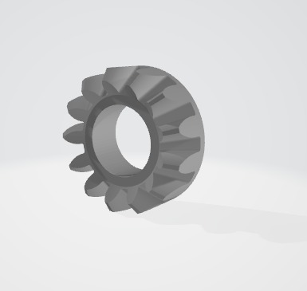 | Gear and Pulley Set | These transmission parts move torque between rotating components. The variants were used to test fit, ratio, engagement, and durability. |
|  | Axle Assembly | This is the assembled axle unit used to mount the wheels and connect the drivetrain. It shows how the axle parts work together as a complete subassembly. |
| 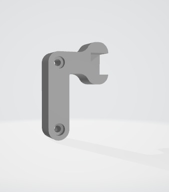 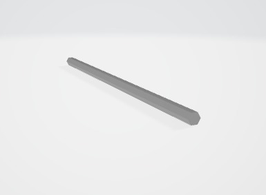 | L-Shaped Link Arms | These offset arms change the direction of motion between connected parts. They are useful where the linkage needs clearance or a directional shift. |
|  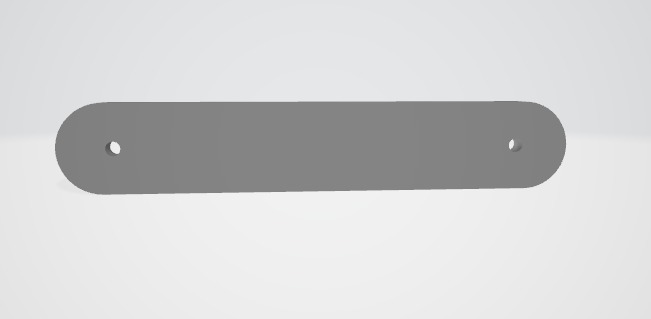 | Support Block and Plate | These are simple support parts used for spacing, reinforcement, and load distribution. They help keep the assembly rigid and stable. |
| 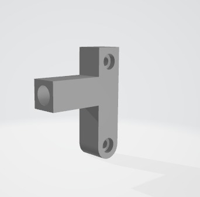 | Hook Arm Assembly | This hooked linkage is used to latch, guide, or restrain a moving element. It helps control motion in constrained sections of the mechanism. |
