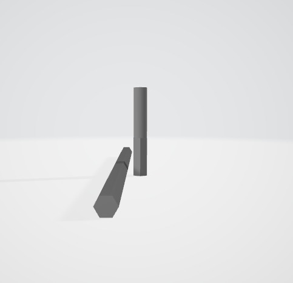
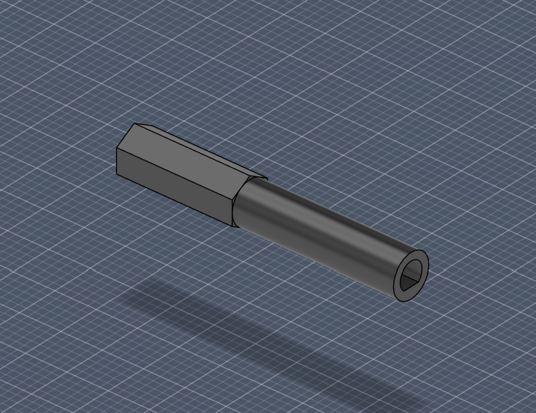
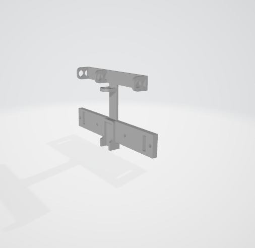
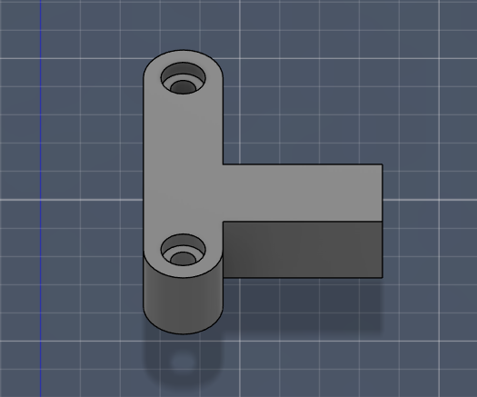
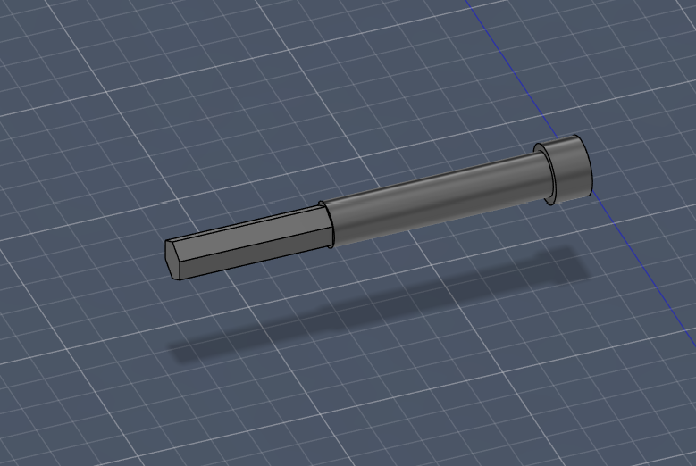
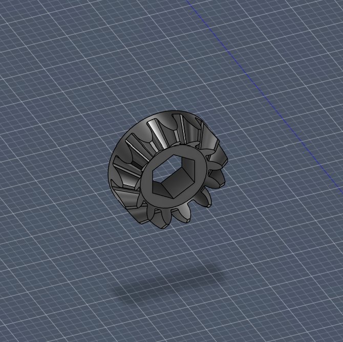
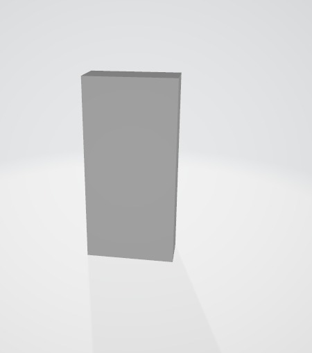

Models
===

This folder contains the 3D model files used to manufacture the vehicle parts shown in the project documentation. The table below is a compact visual index of the model families used in the vehicle.

Only one representative preview image is shown for each family. When a part exists in multiple revisions, the model file names are grouped in the same row so the documentation follows the actual names used in the `.3mf` files.

| Representative preview | Model file(s) | Function |
| --- | --- | --- |
|  | Aks V1.0.3mf Aks V1.1.3mf Aks v1.2.3mf | Main axle variants that transfer torque and support the driven wheel assembly. The different versions were kept as design iterations for fit and strength checks. |
|  | Motor Aks V1.0.3mf Motor Aks V1.1.3mf | Connects motor output to the drivetrain and carries rotational load into the axle or gear system. |
|  | Direksiyon Bağlayıcı kol v1.0.3mf Direksiyon Sol Kol v1.0.3mf Dİreksiyon sağ kol v11.0.3mf Direksiyon Mil Ön Parça v1.0.3mf | Steering linkage parts that convert servo motion into front-wheel steering. These pieces are responsible for directional control and steering geometry. |
|  | Alt Gövde Main.3mf Gövde Alt Parça.3mf Gövde Ana Tam Tasarım.3mf Gövde Ana Tam Tasarım V1.1.3mf Gövde Ana Tam Tasarım V1.2.3mf Gövde Arka Mil 2.1.3mf Gövde Arka Mil v2.1.3mf Gövde2.3mf Gövde3.3mf Gövde6.3mf Gövde7.3mf Arka Mil Taban V2.2.3mf Şase Temeli.3mf | Main chassis and body structure. These files define the vehicle shell, mounting surfaces, and the layout that keeps the mechanical and electronic components aligned. |
|  | Ön Mil Ackerman.3mf Ön Mil Ackerman V1.1.3mf Ön Mil Ackerman V1.2.3mf Ön Tekerlek Mil V1.0.3mf Ön Tekerlek Mili V1.1.3mf Mil Sabitleyici V1.0.3mf | Front axle, wheel shaft, and retention parts that keep the front wheels aligned while allowing the steering mechanism to work correctly. |
|  | DGBOX P5 gear 2.3mf DGBOX P5 gear V2.1.3mf Yapıştırılcak Çark.3mf Yapıştırılcak Çark V1.1.3mf Mesh Hatası Eklenti.3mf | Gear and transmission parts that transfer torque between rotating elements. The versioned files were used to refine tooth fit, strength, and gear mesh behavior. |
|  | Tekerlek V1.0.3mf Tekerlek V1.1.3mf Tekerlek V1.2.3mf Tekerlek V1.3.3mf Tekerlek V1.5.3mf Tekerler V1.4.3mf | Road-contact wheel variants used on the vehicle. They provide traction and support the vehicle during motion. |