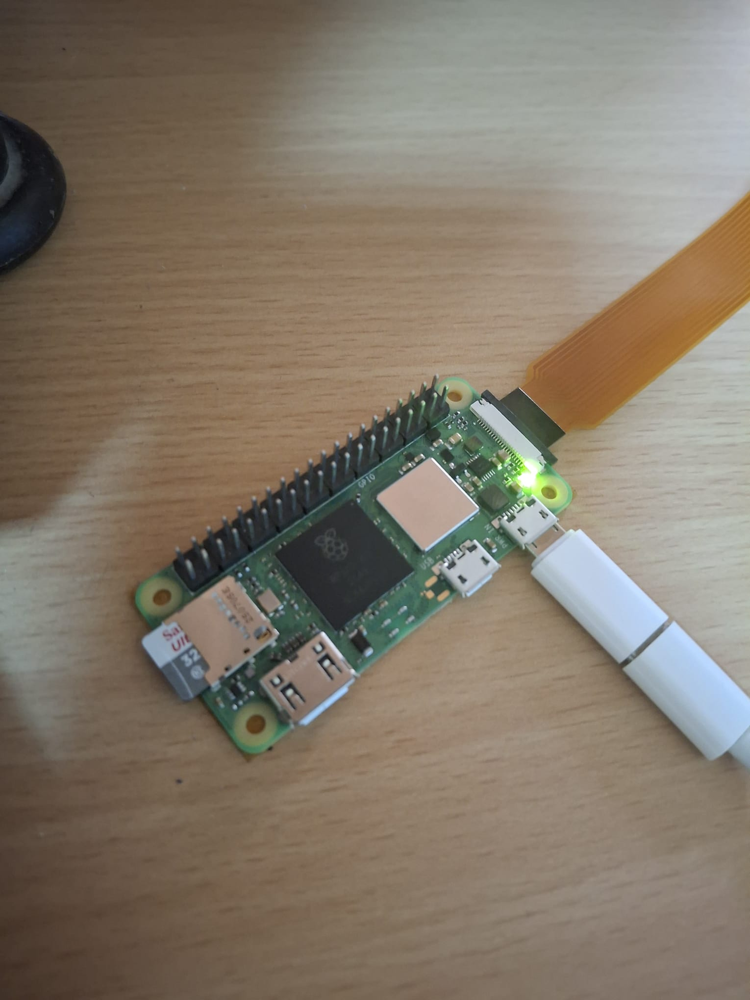
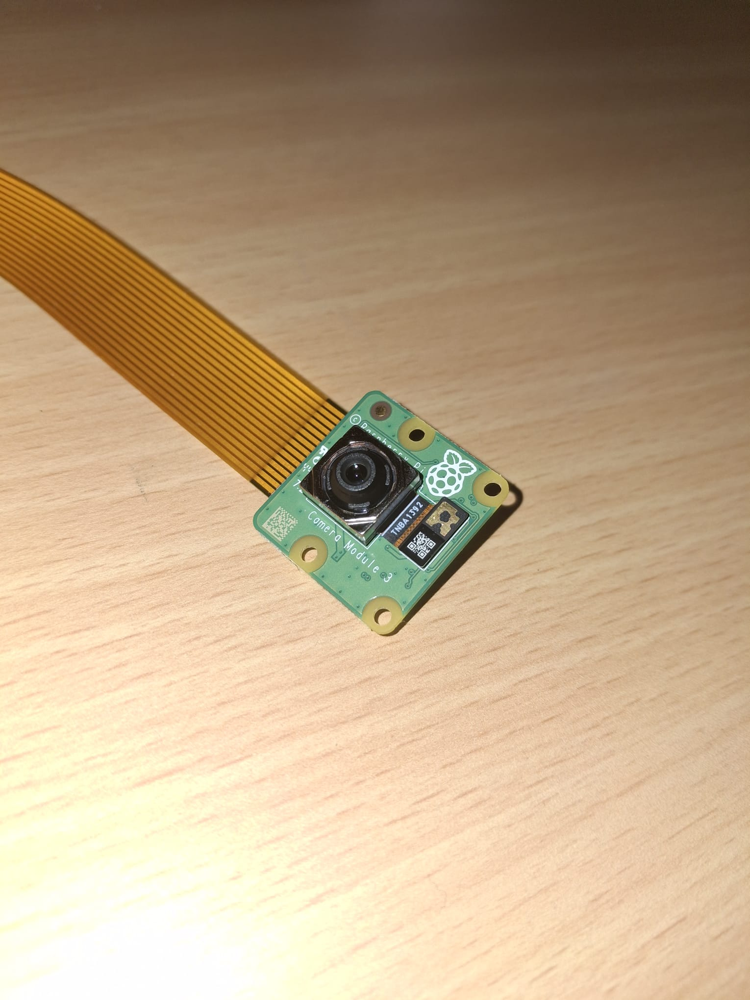
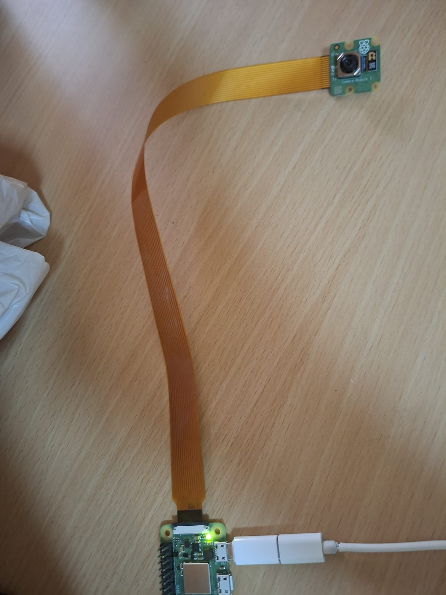

Control software
====

## Color Detecting

The color detecting part of the control software is responsible for reading camera frames, processing the image with OpenCV, identifying the dominant color in the selected camera area, and printing the detected result to the terminal. This module is designed for a Raspberry Pi Zero 2 W with a Raspberry Pi Camera Module 3. Since the project uses the Raspberry Pi camera system, the image is captured with `Picamera2` and then processed with OpenCV.

The main purpose of this code is to detect basic colors such as red, orange, yellow, green, blue, black, and white. The detected color can later be used as an input for the vehicle’s control logic. For example, the robot car can be programmed to stop when red is detected, move forward when green is detected, or make different decisions depending on the color seen by the camera.

### 1. Library Imports

```python
from picamera2 import Picamera2
import cv2
import numpy as np
import time
```

The program starts by importing the required libraries.

`Picamera2` is used to communicate with the Raspberry Pi Camera Module 3 and capture images from the camera.

`cv2` is the OpenCV library. It is used for image processing operations such as color space conversion, masking, and morphological filtering.

`numpy` is used to create array structures for HSV color limits. OpenCV functions such as `cv2.inRange()` require these limits as NumPy arrays.

`time` is used to add short delays between camera startup and frame processing. This helps the camera initialize properly before the program starts detecting colors.

### 2. Camera Setup

```python
camera = Picamera2()

camera_config = camera.create_preview_configuration(
    main={"size": (320, 240), "format": "RGB888"}
)

camera.configure(camera_config)
camera.start()

time.sleep(1)
```

This section initializes the Raspberry Pi camera.

First, a `Picamera2` object named `camera` is created. Then, a preview configuration is created with a resolution of `320x240` pixels. This resolution is intentionally kept low because the Raspberry Pi Zero 2 W has limited processing power. A smaller image size reduces CPU usage and allows the program to run faster.

The image format is set to `RGB888`, which means that each pixel contains red, green, and blue color channels. After configuring the camera, `camera.start()` begins the camera stream.

The `time.sleep(1)` command gives the camera one second to warm up. Without this delay, the first frames may be unstable or incorrectly exposed.

### 3. HSV Color Ranges

```python
color_ranges = {
    "red": [
        ((0, 70, 50), (12, 255, 255)),
        ((165, 70, 50), (180, 255, 255))
    ],
    "orange": [
        ((13, 80, 60), (24, 255, 255))
    ],
    "yellow": [
        ((25, 80, 70), (38, 255, 255))
    ],
    "green": [
        ((40, 60, 50), (88, 255, 255))
    ],
    "blue": [
        ((95, 70, 50), (130, 255, 255))
    ],
    "black": [
        ((0, 0, 0), (180, 255, 45))
    ],
    "white": [
        ((0, 0, 180), (180, 60, 255))
    ]
}
```

The color detection is done in the HSV color space instead of the RGB color space.

HSV stands for Hue, Saturation, and Value. Hue represents the actual color type, saturation represents the intensity of the color, and value represents brightness. HSV is preferred in this project because it is generally more reliable than RGB when working with color detection. In RGB, the same object can have very different red, green, and blue values depending on the light level. HSV makes it easier to define color ranges.

Each color in the `color_ranges` dictionary has one or more HSV intervals. The program checks whether pixels in the camera image fall inside these intervals.

The red color has two separate ranges:

```python
"red": [
    ((0, 70, 50), (12, 255, 255)),
    ((165, 70, 50), (180, 255, 255))
]
```

This is necessary because red is located at both ends of the OpenCV HSV hue scale. In OpenCV, the hue value goes from `0` to `180`, and red appears around both `0` and `180`. Therefore, red must be checked with two separate ranges.

### 4. Region of Interest Selection

```python
def get_center_roi(frame):
    height, width, _ = frame.shape

    start_x = int(width * 0.25)
    end_x = int(width * 0.75)
    start_y = int(height * 0.25)
    end_y = int(height * 0.75)

    return frame[start_y:end_y, start_x:end_x]
```

The `get_center_roi()` function selects the center part of the camera image.

ROI means Region of Interest. Instead of processing the whole frame, the program only processes the center area of the image. This improves detection accuracy because objects outside the important area are ignored.

For example, if the camera sees a colored object in the background, the whole-frame detection could accidentally detect that background color. By using only the center ROI, the program focuses on the object directly in front of the robot car.

The function first reads the height and width of the frame:

```python
height, width, _ = frame.shape
```

Then it calculates the center region by taking the middle 50% of the frame both horizontally and vertically:

```python
start_x = int(width * 0.25)
end_x = int(width * 0.75)
start_y = int(height * 0.25)
end_y = int(height * 0.75)
```

Finally, it returns only that selected part of the frame:

```python
return frame[start_y:end_y, start_x:end_x]
```

### 5. Pixel Counting for Each Color

```python
def get_color_pixel_count(hsv_frame, hsv_ranges):
    total_mask = None

    for lower_bound, upper_bound in hsv_ranges:
        lower_array = np.array(lower_bound, dtype=np.uint8)
        upper_array = np.array(upper_bound, dtype=np.uint8)

        mask = cv2.inRange(hsv_frame, lower_array, upper_array)

        if total_mask is None:
            total_mask = mask
        else:
            total_mask = cv2.bitwise_or(total_mask, mask)

    kernel = np.ones((5, 5), np.uint8)
    total_mask = cv2.morphologyEx(total_mask, cv2.MORPH_OPEN, kernel)
    total_mask = cv2.morphologyEx(total_mask, cv2.MORPH_CLOSE, kernel)

    return cv2.countNonZero(total_mask)
```

The `get_color_pixel_count()` function calculates how many pixels match a specific color range.

The function receives two parameters:

* `hsv_frame`: the camera image converted to HSV format.
* `hsv_ranges`: the HSV lower and upper limits for a specific color.

For every HSV range, the program creates two NumPy arrays:

```python
lower_array = np.array(lower_bound, dtype=np.uint8)
upper_array = np.array(upper_bound, dtype=np.uint8)
```

Then it creates a binary mask:

```python
mask = cv2.inRange(hsv_frame, lower_array, upper_array)
```

The mask is a black-and-white image. Pixels inside the selected HSV range become white, and the rest become black. In other words, white pixels represent areas where the selected color exists.

Some colors, such as red, have more than one HSV range. Because of this, the code combines multiple masks using:

```python
total_mask = cv2.bitwise_or(total_mask, mask)
```

After creating the mask, morphological operations are applied:

```python
kernel = np.ones((5, 5), np.uint8)
total_mask = cv2.morphologyEx(total_mask, cv2.MORPH_OPEN, kernel)
total_mask = cv2.morphologyEx(total_mask, cv2.MORPH_CLOSE, kernel)
```

`MORPH_OPEN` removes small noise from the mask.

`MORPH_CLOSE` fills small gaps inside detected areas.

These operations make the detection more stable and reduce random false detections caused by lighting changes, shadows, or camera noise.

Finally, the function counts the number of white pixels in the mask:

```python
return cv2.countNonZero(total_mask)
```

This value represents how strongly that color appears in the selected camera region.

### 6. Main Color Detection Function

```python
def detect_color(frame):
    corrected_frame = cv2.cvtColor(frame, cv2.COLOR_BGR2RGB)

    roi_frame = get_center_roi(corrected_frame)

    hsv_frame = cv2.cvtColor(roi_frame, cv2.COLOR_RGB2HSV)

    color_counts = {}
    detected_color = "none"
    highest_count = 0

    for color_name, hsv_ranges in color_ranges.items():
        pixel_count = get_color_pixel_count(hsv_frame, hsv_ranges)
        color_counts[color_name] = pixel_count

        if pixel_count > highest_count:
            highest_count = pixel_count
            detected_color = color_name

    minimum_pixel_count = 400

    if highest_count < minimum_pixel_count:
        detected_color = "none"

    return detected_color, highest_count, color_counts
```

The `detect_color()` function is the main image processing function of the color detecting system.

The first step corrects the color channel order:

```python
corrected_frame = cv2.cvtColor(frame, cv2.COLOR_BGR2RGB)
```

This is important because OpenCV and camera libraries may handle color channels differently. If the red and blue channels are reversed, a red object may be detected as blue. This conversion fixes that problem by converting the frame into the expected RGB channel order.

After correcting the frame, the program selects the center region:

```python
roi_frame = get_center_roi(corrected_frame)
```

Then the selected ROI is converted from RGB to HSV:

```python
hsv_frame = cv2.cvtColor(roi_frame, cv2.COLOR_RGB2HSV)
```

After that, the program checks each color inside the `color_ranges` dictionary.

```python
for color_name, hsv_ranges in color_ranges.items():
    pixel_count = get_color_pixel_count(hsv_frame, hsv_ranges)
    color_counts[color_name] = pixel_count
```

For each color, the program calculates how many pixels match that color. These values are stored inside the `color_counts` dictionary. This makes it possible to print every color’s pixel count to the terminal for debugging.

The program then selects the color with the highest pixel count:

```python
if pixel_count > highest_count:
    highest_count = pixel_count
    detected_color = color_name
```

This means the detected color is the color that appears the most in the selected region of the camera image.

A minimum pixel threshold is also used:

```python
minimum_pixel_count = 400
```

If the highest pixel count is lower than this value, the program assumes that no reliable color is detected:

```python
if highest_count < minimum_pixel_count:
    detected_color = "none"
```

This prevents the program from detecting a color because of only a few random noisy pixels.

Finally, the function returns three values:

```python
return detected_color, highest_count, color_counts
```

`detected_color` is the final detected color name.

`highest_count` is the pixel count of the detected color.

`color_counts` contains the pixel counts for all colors and is useful for testing and calibration.

### 7. Continuous Camera Loop

```python
try:
    while True:
        frame = camera.capture_array()

        detected_color, highest_count, color_counts = detect_color(frame)

        print("\033c", end="")
        print("Color detector running...")
        print("Show the object to the CENTER of the camera.")
        print("----------------------------------------")
        print(f"Detected color: {detected_color}")
        print(f"Highest pixel count: {highest_count}")
        print("----------------------------------------")

        for color_name, pixel_count in color_counts.items():
            print(f"{color_name}: {pixel_count}")

        time.sleep(0.3)
```

This part continuously captures images from the camera and detects colors in real time.

The program runs inside a `while True` loop, which means it keeps working until the user manually stops it.

Each loop starts by capturing a new camera frame:

```python
frame = camera.capture_array()
```

Then the frame is sent to the `detect_color()` function:

```python
detected_color, highest_count, color_counts = detect_color(frame)
```

The terminal is cleared before printing the new result:

```python
print("\033c", end="")
```

This makes the terminal output easier to read because the values update in place instead of endlessly filling the screen.

The detected color and pixel count are printed:

```python
print(f"Detected color: {detected_color}")
print(f"Highest pixel count: {highest_count}")
```

Then the pixel count of every color is printed:

```python
for color_name, pixel_count in color_counts.items():
    print(f"{color_name}: {pixel_count}")
```

This is helpful during testing because it shows how close the other colors are. For example, if a red object produces a high blue pixel count, this may indicate a camera channel issue or incorrect HSV range.

The loop waits for `0.3` seconds before processing the next frame:

```python
time.sleep(0.3)
```

This delay makes the terminal output readable and reduces unnecessary CPU usage.

### 8. Safe Program Stopping

```python
except KeyboardInterrupt:
    print("\nProgram stopped by user.")

finally:
    camera.stop()
    print("Camera stopped.")
```

This section makes sure the program exits safely.

When the user presses `CTRL + C`, Python raises a `KeyboardInterrupt`. The program catches it and prints:

```python
Program stopped by user.
```

The `finally` block always runs, even if the program is stopped manually. It stops the camera using:

```python
camera.stop()
```

This is important because the camera resource should be released properly. Otherwise, the camera may stay locked and cause problems when the program is started again.

### Summary

In summary, the color detecting software captures images from the Raspberry Pi Camera Module 3, selects the center region of the frame, converts that region into HSV color space, creates masks for each target color, counts the matching pixels, and prints the dominant detected color to the terminal.

### Hardware Components Used for Color Detecting

| Component                        | Image                                                   | Purpose                                                                                                                                                                            |
| -------------------------------- | ------------------------------------------------------- | ---------------------------------------------------------------------------------------------------------------------------------------------------------------------------------- |
| Raspberry Pi Zero 2 W            |  | The Raspberry Pi Zero 2 W runs the Python control software and processes the camera frames using OpenCV. It acts as the main onboard computer of the vehicle.                      |
| Raspberry Pi Camera Module 3     |       | The Camera Module 3 captures real-time images from the environment. These images are used by the color detection algorithm to identify objects or markers in front of the vehicle. |
| Raspberry Pi Camera Ribbon Cable |   | The camera ribbon cable connects the Camera Module 3 to the Raspberry Pi Zero 2 W. It transfers image data from the camera to the Raspberry Pi for processing.                     |


This module is an important part of the robot car’s control software because it converts visual information into simple color-based data. This detected color can later be connected to the decision-making part of the vehicle, allowing the car to react to colored signs, objects, or track markers.
